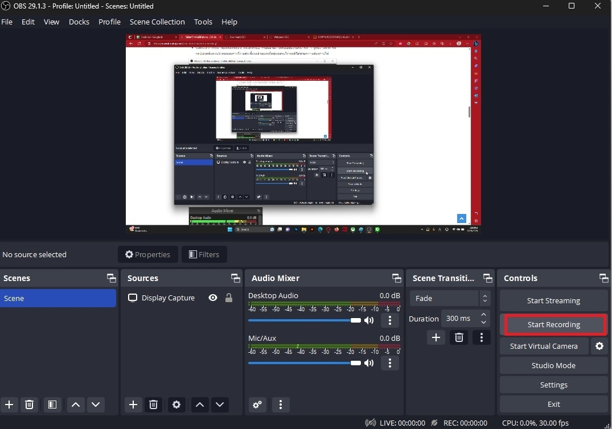

# OBS Studio

OBS Studio หรือ Open Broadcaster Software Studio เป็นโปรแกรมสำหรับบันทึกวิดีโอที่เหมาะกับการทำ Live Stream ตอบโจทย์ในเรื่องของการจับภาพหน้าจอแบบสดๆ อย่างการเล่นเกม ทดสอบซอฟต์แวร์ ฯลฯ ตัวโปรแกรมยังมีฟีเจอร์ที่สามารถรวมภาพ เสียงพากย์สด เข้าไปเป็นส่วนหนึ่งของวิดีโอไลฟ์สดได้ด้วย

`ระบบปฏิบัติการที่รองรับ: Linux, Mac, Windows`
## การใช้งาน OBS Studio

1. ติดตั้ง OBS Studio จาก [Download OBS Studio](https://obsproject.com/download)

2. เปิดโปรแกรม OBS Studio และเลือกเมนู Settings เพื่อกำหนด Resolution ให้มีความละเอียดของการบันทึกระดับ HD ที่ความละเอียด 1920×1080 และกำหนดค่า FPS (Frame Rate Per Sec) เท่ากันกับ 30 

3. ตั้งค่าการจัดเก็บไฟล์ที่บันทึก โดยกำหนด Recording Quality ให้กำหนดคุณภาพวิดีโอเป็น High Quality, Medium File Size และ
กำหนดนามสกุลไฟล์เป็น .mp4

4. กดปุ่มเครื่องหมายบวก (+) ในส่วนของ Source เลือก Display Capture เพื่อเลือกภาพหน้าจอเข้าสู่โปรแกรม

5. ในส่วนของ Audio Mixer นั้น เราสามารถกำหนดได้ว่าต้องการให้เสียงส่วนไหนเข้าไปอยู่ในการบันทึกหน้าจอบ้าง 

    - Desktop Audio เสียงที่เราได้ยินจากเครื่องคอมพิวเตอร์นั้นๆ ไม่ว่าจะเป็นเสียงจากการเปิดเพลงหรือวิดีโอต่างๆ

    - Mux/Aux เสียงของไมโครโฟน

6. เมื่อตั้งค่าโปรแกรมเรียบร้อยแล้ว เราสามารถกดปุ่ม Start Recording เพื่อเริ่มบันทึกหน้าจอได้ทันที

7. หากต้องการสิ้นสุดการบันทึกหน้าจอสามารถกดปุ่ม Stop Recording และหากต้องการหยุดการอัดชั่วคราวก็สามารถกดปุ่ม PAUSE ได้เช่นกัน

# References
- [วิธีการอัดหน้าจอโดยใช้โปรแกรม OBS Studio](https://www.kruploy.com/obs-studio-screen-recording/)
- [Download OBS Studio](https://obsproject.com/download)

